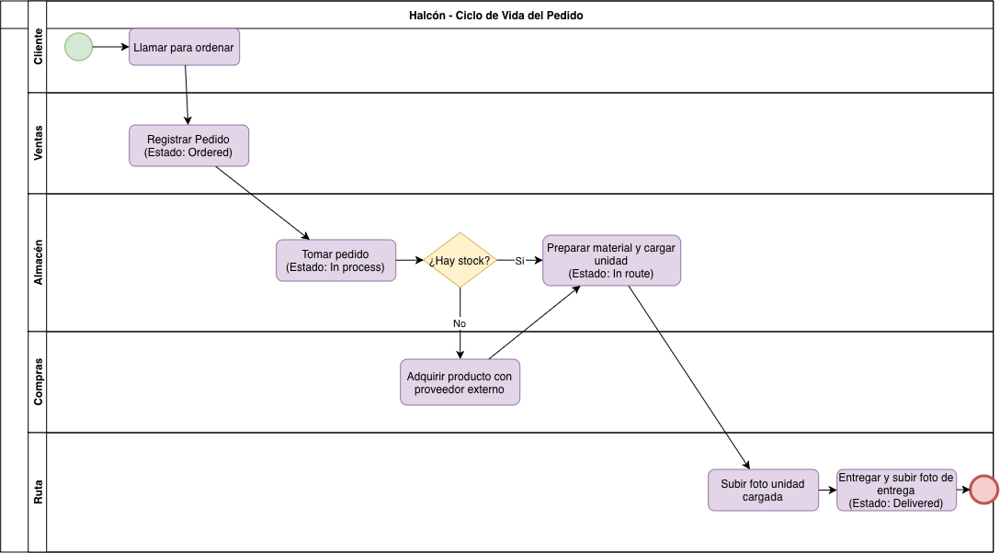
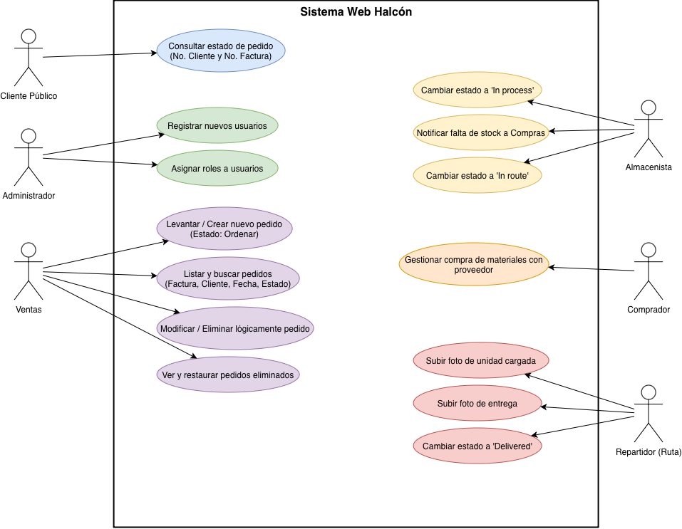
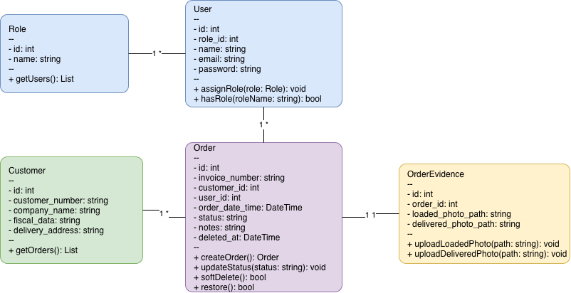
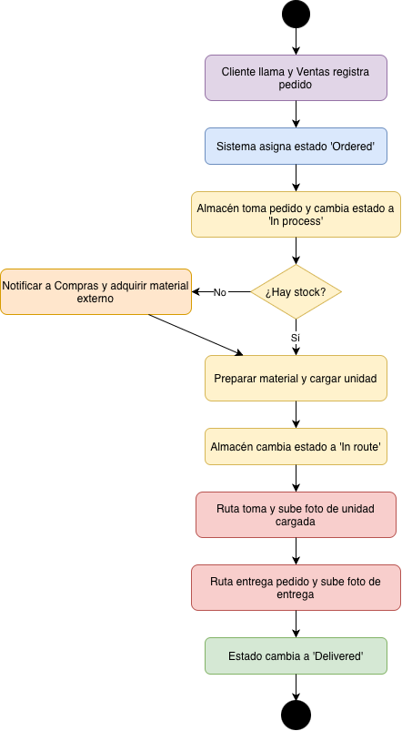
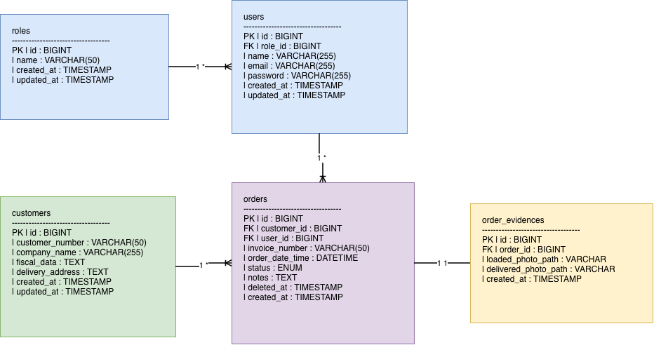

# Entregable Final - Proyecto Aplicación Web "Halcón"

---

## 1. Introducción y Análisis del Problema

La empresa Halcón, dedicada a la distribución de materiales de construcción, requiere la automatización de sus procesos clave. La solución planteada consiste en una aplicación web desarrollada con el stack Laravel (PHP / MySQL) que integra:

* Consulta pública del estado del pedido para clientes (`Ordered`, `In process`, `In route`, `Delivered`).
* Dashboard administrativo con control de accesos basado en roles (`Sales`, `Purchasing`, `Warehouse`, `Route`, `Admin`).
* Seguimiento completo del ciclo de vida del pedido e integración de evidencias fotográficas.
* Auditoría de datos mediante borrado lógico (*Soft-Delete*).

---

## 2. Metodología de Trabajo

### Selección del Marco de Trabajo
Para el desarrollo de la Aplicación Web "Halcón", se seleccionó el framework Scrum.

### Justificación
La automatización de procesos de distribución de materiales involucra múltiples áreas con requerimientos específicos. Scrum es la metodología idónea debido a:

1. **Entregas Incrementales y Priorizadas:** Permite desplegar primero los módulos de mayor valor operativo, como la consulta pública de pedidos y el control de accesos por roles.
2. **Adaptabilidad ante Cambios:** Las iteraciones cortas (Sprints de 2 semanas) facilitan ajustar los flujos de trabajo de almacén y ruta según la retroalimentación directa del personal operativo.
3. **Transparencia y Control de Calidad:** Mediante los eventos de Scrum (Daily, Review y Retrospectiva) se mantiene visibilidad constante sobre los avances técnicos y la resolución de bloqueos.

---

## 3. Diagramas del Sistema

### A. Diagrama BPMN (Lógica de Negocio)

### B. Diagrama de Casos de Uso

### C. Diagrama de Clases

### D. Diagrama de Actividades

---

## 4. Base de Datos y Diagrama Entidad-Relación (ER)

### Diagrama Entidad-Relación

### Especificación de Entidades y Tipos de Datos

1. **`users`**: Almacena las credenciales y roles del personal administrativo y operativo.
   * Atributos: `id` (PK), `name` (VARCHAR), `email` (VARCHAR), `password` (VARCHAR), `role` (ENUM), `deleted_at` (TIMESTAMP).
2. **`products`**: Catálogo de materiales de construcción.
   * Atributos: `id` (PK), `sku` (VARCHAR), `name` (VARCHAR), `stock` (INT), `price` (DECIMAL), `deleted_at` (TIMESTAMP).
3. **`orders`**: Registro del pedido y su estado actual en el flujo.
   * Atributos: `id` (PK), `tracking_number` (VARCHAR), `customer_name` (VARCHAR), `status` (ENUM), `user_id` (FK), `deleted_at` (TIMESTAMP).
4. **`order_items`**: Detalle de los artículos solicitados en cada pedido.
   * Atributos: `id` (PK), `order_id` (FK), `product_id` (FK), `quantity` (INT), `unit_price` (DECIMAL).
5. **`delivery_evidences`**: Fotografía adjunta como comprobante de entrega.
   * Atributos: `id` (PK), `order_id` (FK), `image_path` (VARCHAR), `uploaded_at` (TIMESTAMP).

---

## 5. Reflexiones Finales

1. **¿Cómo influyó la definición clara de roles y metodologías ágiles en el diseño de la aplicación Halcón?**
   El marco Scrum permitió descomponer el flujo operativo de la distribuidora en historias de usuario bien delimitadas según el rol (`Sales`, `Purchasing`, `Warehouse`, `Route`, `Admin`), garantizando que la solución técnica responda a las necesidades reales de cada etapa del proceso.

2. **¿Por qué es fundamental estructurar correctamente la base de datos antes de iniciar la codificación en Laravel?**
   Diseñar el modelo Entidad-Relación de forma previa asegura la integridad referencial de los datos, facilita la creación de las migraciones y modelos en Eloquent ORM, y garantiza el correcto funcionamiento de características críticas como las auditorías y el borrado lógico (*Soft-Delete*).
